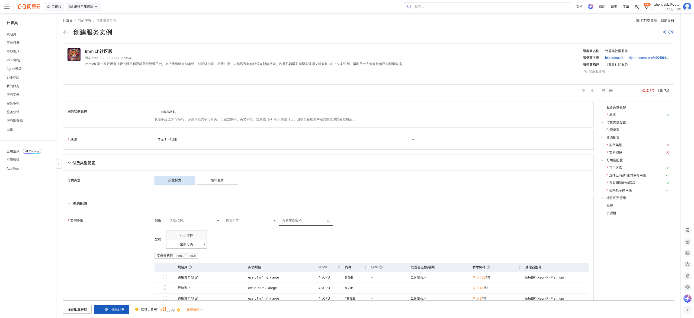
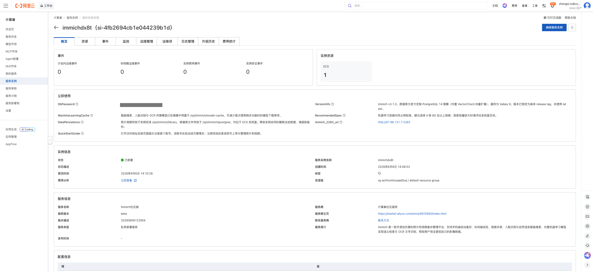
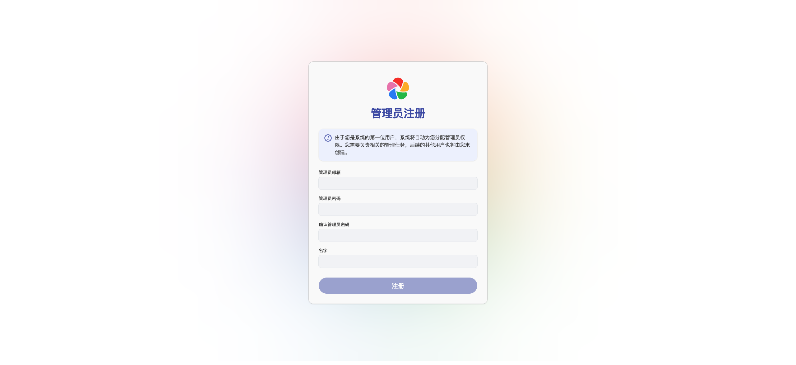

# Immich社区版 部署文档

## 概述

Immich社区版 是一款开源自托管的照片和视频备份管理平台，支持手机端自动备份、时间轴浏览、相册共享，并内置机器学习模型实现自然语言语义检索与 OCR 文字识别，帮助用户完全掌控自己的影像数据。通过阿里云计算巢服务，您可以快速部署 Immich社区版，实现开箱即用。

本服务基于 Immich v3.1.0，随实例编排 Immich 服务端、机器学习服务、官方定制 PostgreSQL 14（内置 VectorChord 向量扩展）与 Valkey 9 缓存，统一通过 2283 端口提供 Web 与 API 访问。

## 部署流程

### 1. 创建服务实例

访问 Immich社区版 服务部署链接，按提示填写部署参数：

[部署链接](https://computenest.console.aliyun.com/service/instance/create/cn-hangzhou?type=user&ServiceId=service-a1edcc73f59743d58474)

需要您填写的参数只有两项：**实例类型**与**实例密码**。机器学习容器内存占用较高，实例类型建议选择 4 核 8G 及以上规格（例如 `ecs.u1-c1m2.xlarge`）。数据库口令由系统自动生成，无需填写。

### 2. 确认订单并创建

参数填写完成后可以看到对应询价明细，确认参数后点击 **下一步：确认订单**。确认订单完成后同意服务协议并点击 **立即创建** 进入部署阶段。

### 3. 等待部署完成

等待部署完成后进入服务实例管理，在控制台找到 Immich社区版 访问链接。

**立即使用**区域的 `immich_2283_url` 即为服务访问地址。

### 4. 访问服务

单击链接访问服务。

### 5. 注册首个账号

Immich 未预置任何账号。首次打开访问地址后点击 **入门**，注册的第一个账号会自动成为管理员；注册完成后登录即可上传与管理照片和视频。

## 使用说明

- **数据存储位置**：照片视频存放于实例目录 `/opt/immich/library`，数据库文件存放于 `/opt/immich/postgres`，均位于 ECS 系统盘。释放实例会同时删除这些数据，请提前备份。
- **机器学习模型缓存**：智能搜索、人脸识别与 OCR 所需模型已在镜像中预置于 `/opt/immich/model-cache`，可减少首次使用相关功能时的模型下载等待。
- **版本说明**：版本已锁定为具体 release tag（v3.1.0），未使用 `latest`。Immich 官方处于快速迭代阶段，升级前请先阅读官方的破坏性变更说明。
- **安全建议**：服务通过公网 IP 的 2283 端口直接访问，且首个访问者即可注册为管理员。建议部署后尽快完成管理员注册，并将安全组 2283 端口的来源地址收敛为可信网段。

## 官方文档

更多信息请访问官方文档：[Quick start | Immich](https://docs.immich.app/)
